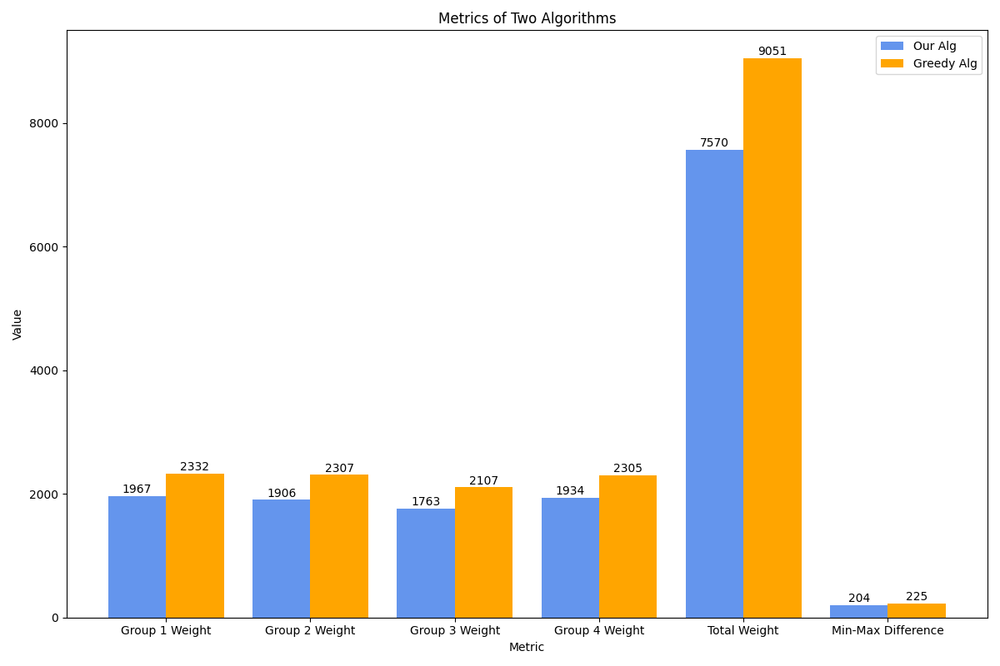

# Fairness in Online Bipartite Matching Problems

We proposed an innovative algorithm called Priority-Updated-Match for online bipartite matching problems to ensure fairness among different groups.

The figures in the following are the result of our algorithm against the baseline greedy algorithm.

The full paper and results can be found in "Online_bipartite_matching_problem.pdf" file.

The code of our algorithm implementation is stored in the "priority_algorithm.py" file.

The "draw_plot.py" file is the code for drawing results for experiments.

This is the plot for 200 vertex.

This is the plot for 20 vertex.
